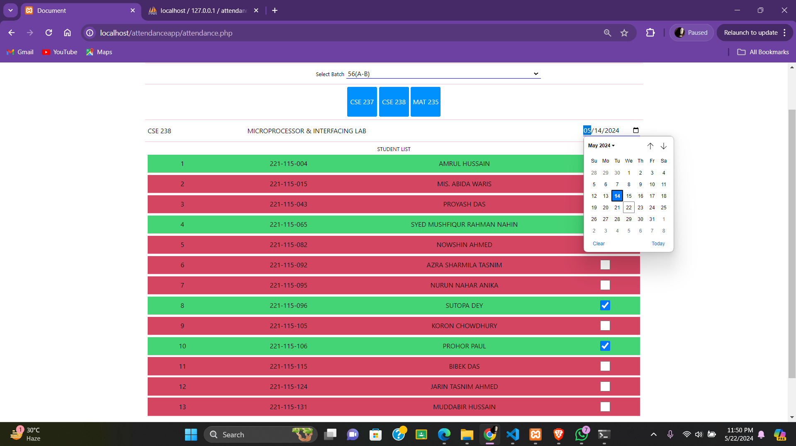

# Attendance Management and Tracking System

## Project Overview
The Attendance Management and Tracking System is a web-based application designed to streamline the process of tracking and managing attendance for students and faculty members. This system aims to reduce the time and effort required for manual attendance management and provides a user-friendly interface for easy interaction.

## Main Theme
The main theme of this project is to automate and simplify the attendance tracking process for educational institutions. By leveraging modern web technologies, this system ensures accurate and efficient recording of attendance, allowing for better time management and resource allocation.

## Features
- *User Authentication*: Secure login for students, faculty, and administrators.
- *Attendance Recording*: Easy and quick recording of attendance via a user-friendly interface.
- *Real-time Tracking*: Immediate updates and visibility of attendance records.
- *Student Access to Reports*: Students can view and download their final attendance report.

- *Database Management*: Efficient storage and retrieval of attendance data using MySQL.

## Technologies Used
- *HTML*: For structuring the web pages.
- *Tailwind CSS*: For styling the web pages.
- *JavaScript*: For client-side scripting.
- *jQuery*: For easier manipulation of HTML and JavaScript.
- *PHP*: For server-side scripting.
- *MySQL*: For database management.

## Team Members
- *Member 1*: [Nurun Nahar Anika]
  
- *Member 2*: [Nayeb Ahmed Qureshi]
 
- *Member 3*: [Ashraful Quaiyum Chowdhury Shafi]
  
- *Member 4*: [Jarin Tasnim Ahmed Raisa]

